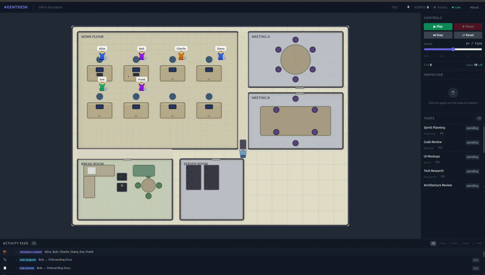

# 🏢 AgentDesk

### 🎥 Demo Recording



---

## 🚀 Overview

**AgentDesk** is a sophisticated, web-based office simulation where AI agents live, work, and collaborate in real-time. The project explores the intersection of **Hybrid Intelligence** and **In-Memory Simulations**, featuring agents that alternate between rule-based behavior and high-level LLM reasoning.

Watch your agents attend meetings, chat at the watercooler, complete deep-work tasks, and take breaks—all while monitoring their cognitive and physical vitals via a built-in observability stack.

---

## ✨ Key Features

### 🧠 Hybrid Intelligence

- **Rule-Based Execution**: High-performance, deterministic simulation logic handles movement, task progression, and scheduling.
- **LLM Reasoning**: Periodic high-level reasoning powered by **DeepSeek**, allowing agents to "explain" their internal feelings, goals, and upcoming plans.
- **Cognitive Vitals**: Real-time tracking of agent **Energy**, **Focus**, and **Mood**.

### 🎮 Live Simulation

- **Dynamic Office Canvas**: A modern, blueprint-style UI showing rooms, furniture, and animated agent avatars.
- **Interactive Inspector**: Click any agent to see their current task, recent history, and "inner thoughts."
- **Command Center**: Admin tools to reset the simulation, toggle LLM logic, and manually inject critical tasks.

### 📊 Full observability

- **Prometheus Integration**: Backend metrics exported at `/metrics/` for tracking sim performance and agent health.
- **Grafana Dashboards**: Pre-provisioned dashboards for visual telemetry and task throughput analysis.

---

## 🛠 Tech Stack

- **Frontend**: Vue 3, Pinia, Tailwind CSS, HTML5 Canvas API.
- **Backend**: FastAPI (Python 3.11+), Uvicorn.
- **State Management**: In-memory Python store with WebSocket broadcasting.
- **Observability**: Prometheus & Grafana.
- **Database/Caching**: PostgreSQL & Redis.
- **Asynchronous Tasks**: Celery with Redis broker.

---

## 📖 Quick Start

### Prerequisites

- Docker & Docker Compose
- DeepSeek API Key (Optional, for LLM features)

### Launching the Office

1. **Clone the repository**:

   ```bash
   git clone https://github.com/eddgachi/agent-desk.git
   cd agent-desk
   ```

2. **Configure Environment**:
   Create a `.env` file or export:

   ```bash
   export DEEPSEEK_API_KEY=your_key_here
   export LLM_ENABLED=true
   ```

3. **Spin up with Docker**:

   ```bash
   docker compose up --build
   ```

4. **Access the Services**:
   - **Main UI**: [http://localhost:5173](http://localhost:5173)
   - **Backend API**: [http://localhost:8000/docs](http://localhost:8000/docs)
   - **Prometheus**: [http://localhost:9090](http://localhost:9090)
   - **Grafana**: [http://localhost:3000](http://localhost:3000) (User: `admin` / Pass: `admin`)

---

## 🏗 Architecture

AgentDesk uses a hub-and-spoke model for real-time updates:

- **Simulation Engine**: Processes ticks every ~1s, updating positions and task states.
- **WebSocket Manager**: Streams incremental tick updates and event logs to all connected clients.
- **AI Runtime**: Manages agent-specific memory buffers and triggers background LLM inference without blocking the core simulation loop.

---

## 🤝 Contributing

Contributions are welcome! Please feel free to submit a Pull Request.

## 📄 License

MIT License - Copyright (c) 2026 AgentDesk
